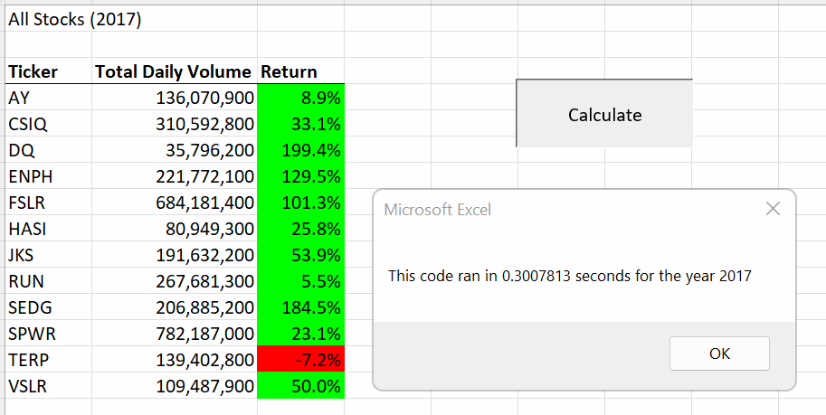
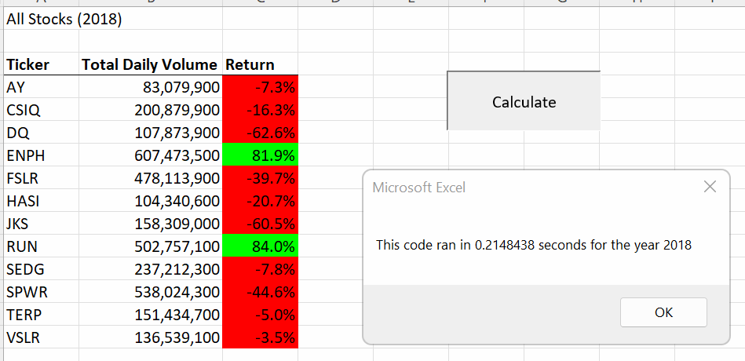

# Stock-Analysis

## Overview of Project

A VBA scripts to analyze 2 years of stock Data.

## Results: 

Stocks overall performed better in 2018 than they did in 2017. Also, the refactored scripts ran much faster than the original.

## Summary: 
### What are the advantages or disadvantages of refactoring code?
The advantages are, it run faster and it can be used for other years.
                    
### How do these pros and cons apply to refactoring the original VBA script?
Refactoring code make it possible to be used in other scenerio.
